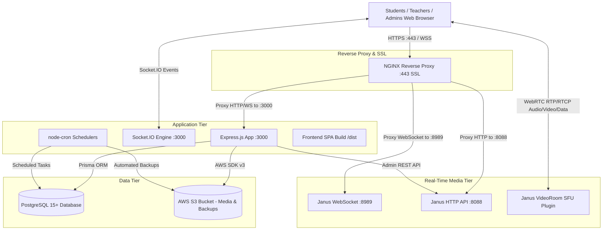

# 🏛️ Architecture & System Overview

## 1. System Architecture

StudyAsan ACMS follows a modern, scalable client-server architecture designed for high concurrency, real-time interactivity, and seamless media streaming:



---

## 2. Core Functional Modules

### 2.1 Authentication & Role-Based Access Control (RBAC)
* **Roles**: `ADMIN`, `TEACHER`, `STUDENT`, `PARENT`.
* **Tokens**: JWT signed tokens transmitted via `Authorization: Bearer <token>` header.
* **Middleware**: `authenticate` middleware in `backend/src/middleware/auth.middleware.ts` validates JWTs and attaches the user payload (`req.user`) to Express requests.
* **Teacher Isolation**: Teachers only access assigned sections, student groups, courses, and test series.

### 2.2 Live Virtual Classroom (Janus WebRTC)
* **Live Video/Audio**: Powered by Janus VideoRoom SFU plugin. Supports high-definition teacher broadcasting, student multi-video streams, audio muting, and screen sharing.
* **Collaborative Whiteboard**: Synchronized in real-time across teacher and students via Janus WebRTC Data Channels and backed up to PostgreSQL.
* **Session Lifecycle**: Automatically managed by `ClassSessionScheduler` which updates session status (`UPCOMING` → `LIVE` → `COMPLETED`) based on schedule times.

### 2.3 Interactive Gamified Activities Engine
* **Supported Activity Types**:
  1. **Abacus Math Lab**: Authentic 1-4 Japanese Soroban abacus simulation with place values (1, 10, 100, 1,000, 10,000) and step-by-step arithmetic verification.
  2. **Live Multiplayer Quiz**: Real-time multiplayer classroom quizzes with live leaderboards, sound effects, and celebratory animations.
  3. **Word Search Puzzle**: Interactive letter grid vocabulary games.
  4. **Sudoku**: Classic logic puzzles with hint systems.
  5. **Chess & Puzzles**: Interactive board challenges.
  6. **Match Pairs**: Memory card matching activities.
  7. **True / False Challenge**: Rapid-fire trivia format.
  8. **Hangman Word Guessing**: Letter elimination vocabulary practice.

### 2.4 Test Series & Online CBT Examination Engine
* **Features**: Full mock tests, timed exams, auto-grading for objective questions, manual grading for subjective questions, performance analytics, and test series junction assignments for teachers.
* **Safety**: Automatic response saves and submission handling.

### 2.5 Billing, Invoicing & Quotations
* **Fee Structure**: Supports official course fees, quotations, and automated tax invoicing.
* **Payment Gateways**: Pluggable support for online payment gateways (Razorpay / Stripe) with public config exposure for self-enrollment.

---

## 3. Codebase Directory Map

### Backend (`/root/acms/backend`)
```
backend/
├── prisma/
│   └── schema.prisma              # PostgreSQL schema & relationships
├── src/
│   ├── controllers/               # API endpoint request handlers
│   │   ├── auth.controller.ts
│   │   ├── classSession.controller.ts
│   │   ├── activity.controller.ts
│   │   ├── testSeries.controller.ts
│   │   ├── videoRoom.controller.ts
│   │   └── ...
│   ├── middleware/                # Auth, role check & error middlewares
│   ├── routes/                    # Express route definitions (/api)
│   ├── services/                  # Business logic & background jobs
│   │   ├── databaseBackup.service.ts
│   │   ├── janusAdmin.service.ts
│   │   ├── janusCleanup.service.ts
│   │   ├── dataRetentionCleanup.service.ts
│   │   ├── recordingCleanup.service.ts
│   │   ├── classSessionScheduler.service.ts
│   │   └── notificationProcessor.service.ts
│   ├── socket/                    # Socket.IO handlers
│   ├── utils/                     # S3 uploaders, helpers, emailers
│   └── server.ts                  # Server entrypoint & cron initializations
├── package.json
└── tsconfig.json
```

### Frontend (`/root/acms/frontend`)
```
frontend/
├── src/
│   ├── components/
│   │   ├── activities/            # Activity builders, runners & game UIs
│   │   │   ├── admin/             # Activity form & admin builders
│   │   │   ├── common/            # Celebration modals, audio hooks
│   │   │   └── games/             # AbacusGame, QuizGame, etc.
│   │   ├── classroom/             # Video grids, whiteboard, control bars
│   │   ├── home/                  # ItemDetailModal, explore cards
│   │   └── ui/                    # Reusable Tailwind UI components
│   ├── hooks/
│   │   ├── useJanus.ts            # WebRTC Janus connection hook
│   │   └── useSound.ts            # Audio SFX engine
│   ├── pages/                     # Routed view components
│   ├── services/                  # API and Janus client services
│   │   ├── api.ts
│   │   └── janus/                 # JanusClient WebRTC wrapper
│   ├── types/                     # Shared TypeScript interfaces
│   ├── App.tsx                    # React router & providers
│   └── main.tsx                   # Frontend entry point
├── package.json
├── tailwind.config.js             # Brand styling (saBlue: #0276D3, saVividOrange: #eca209)
└── vite.config.ts
```
