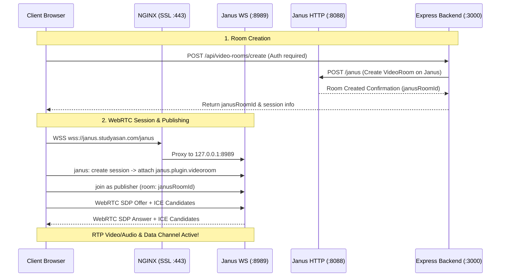

# 📹 Janus WebRTC & Live Classroom Guide

## 1. Overview of Janus in StudyAsan ACMS

**Janus** is an open-source WebRTC Server developed by Meetecho that functions as a Selective Forwarding Unit (SFU). In StudyAsan ACMS, Janus powers the real-time virtual classroom system, providing:
* Multi-participant video/audio conferencing.
* Real-time screen sharing.
* Ultra low-latency WebRTC Data Channels for whiteboard synchronization, chat, emojis, and hand-raising.
* Server-side moderation (remote participant muting, kicking).

---

## 2. Infrastructure & Port Mapping



### Network Endpoints & Ports

| Service | Protocol | External URL | Internal Proxy Destination | Purpose |
| :--- | :--- | :--- | :--- | :--- |
| **WebSockets** | WSS (SSL) | `wss://janus.studyasan.com/janus` | `http://127.0.0.1:8989` | Client signaling, SDP offers/answers, ICE trickle |
| **HTTP REST API** | HTTPS | `https://janus.studyasan.com/api` | `http://127.0.0.1:8088/janus` | Backend room management & plugin control |
| **Admin API** | HTTP | Internal only | `http://127.0.0.1:7088` | Admin moderation & diagnostic statistics |
| **RTP / RTCP Media** | UDP | Public IP | Ports `20000-40000` | Real-time audio and video packets |

---

## 3. Server Configuration Files

Janus configuration files are located on the server at `/etc/janus/`:

### 3.1 Main Gateway Config: `/etc/janus/janus.jcfg`
```jcfg
general: {
    configs_folder = "/etc/janus"
    plugins_folder = "/usr/lib/janus/plugins"
    transports_folder = "/usr/lib/janus/transports"
    events_folder = "/usr/lib/janus/events"
    log_to_stdout = true
    debug_level = 4
}
nat: {
    stun_server = "stun.l.google.com"
    stun_port = 19302
    nice_debug = false
}
media: {
    rtp_port_range = "20000-40000"
}
```

### 3.2 WebSocket Transport: `/etc/janus/janus.transport.websockets.jcfg`
```jcfg
general: {
    ws = true
    ws_port = 8989
    ws_interface = "127.0.0.1"
    wss = false                 # SSL is handled upstream by NGINX reverse proxy
}
```

### 3.3 VideoRoom Plugin: `/etc/janus/janus.plugin.videoroom.jcfg`
```jcfg
general: {
    admin_key = "YOUR_JANUS_ADMIN_KEY"
    events = true
}
```

---

## 4. NGINX Reverse Proxy Configuration

Located at `/etc/nginx/sites-available/janus.conf`:

```nginx
server {
    server_name janus.studyasan.com;

    # WebSocket endpoint for client connections
    location /janus {
        proxy_pass http://127.0.0.1:8989;
        proxy_http_version 1.1;

        proxy_set_header Upgrade $http_upgrade;
        proxy_set_header Connection "upgrade";
        proxy_set_header Host $host;

        proxy_read_timeout 86400;
        proxy_send_timeout 86400;
    }

    # HTTP API endpoint for backend room administration
    location /api {
        proxy_pass http://127.0.0.1:8088/janus;
        proxy_set_header Host $host;
        proxy_set_header X-Real-IP $remote_addr;
    }

    # Admin API endpoint
    location /admin {
        proxy_pass http://127.0.0.1:7088;
        proxy_set_header Host $host;
        proxy_set_header X-Real-IP $remote_addr;
    }

    listen 443 ssl;
    ssl_certificate /etc/letsencrypt/live/janus.studyasan.com/fullchain.pem;
    ssl_certificate_key /etc/letsencrypt/live/janus.studyasan.com/privkey.pem;
    include /etc/letsencrypt/options-ssl-nginx.conf;
    ssl_dhparam /etc/letsencrypt/ssl-dhparams.pem;
}

server {
    if ($host = janus.studyasan.com) {
        return 301 https://$host$request_uri;
    }
    listen 80;
    server_name janus.studyasan.com;
    return 404;
}
```

---

## 5. Client & Backend Integration Workflow

### 5.1 Frontend Architecture (`frontend/src/services/janus`)
* **`JanusClient.ts`**: Core WebRTC wrapper that manages the WebSocket lifecycle, plugin handles (`videoroom`), peer connection initialization, and candidate exchange.
* **`useJanus.ts`**: Custom React hook used inside `ClassroomPage.tsx` to bind local/remote media tracks, participant state, audio/video toggle handlers, and whiteboard events.
* **Data Channels**: Used for peer-to-peer broadcast of:
  * Whiteboard drawing coordinates (strokes, clear, undo).
  * In-classroom emoji reactions and hand-raising events.

### 5.2 Backend Administration & Auto-Cleanup
* **`janusAdmin.service.ts`**: Communicates with Janus HTTP API to create rooms on demand and kick disruptive participants.
* **`janusCleanup.service.ts`**: Automated cron job running every hour (`0 * * * *`) that queries active Janus sessions and destroys abandoned or empty rooms to conserve server resources.

---

## 6. Janus Management Commands

```bash
# Check service status
sudo systemctl status janus

# Restart Janus Gateway
sudo systemctl restart janus

# View real-time Janus logs
sudo journalctl -u janus -f -n 100

# Test WebSocket connection locally
curl -i -N -H "Connection: Upgrade" -H "Upgrade: websocket" -H "Host: 127.0.0.1:8989" -H "Origin: http://127.0.0.1" http://127.0.0.1:8989/
```
