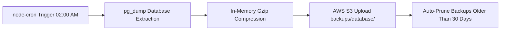

# 💾 Backups & Disaster Recovery Guide

StudyAsan ACMS features an **in-application automated backup engine** combined with standard PostgreSQL disaster recovery capabilities.

---

## 1. Automated PostgreSQL Database Backups to AWS S3

### 1.1 Architecture & Workflow
The backend includes `DatabaseBackupService` (`backend/src/services/databaseBackup.service.ts`), which runs automatically inside the Node.js process:



### 1.2 Automated Schedule & Configuration
* **Default Schedule**: Every day at **02:00 AM** (`0 2 * * *`).
* **S3 Destination**: `s3://<AWS_S3_BUCKET>/backups/database/db_backup_YYYY-MM-DDTHH-MM-SS.sql.gz`
* **Retention Policy**: Automatically preserves the **last 30 daily backups** and deletes older archives to prevent S3 storage bloat.
* **Environment Configuration**:
  ```env
  DB_BACKUP_CRON_SCHEDULE="0 2 * * *"
  DB_BACKUP_RETENTION_COUNT="30"
  ```

---

## 2. On-Demand & Manual Database Backups

### 2.1 Trigger via Admin API Endpoint
Admins can trigger an instant backup directly via API:
```bash
curl -X POST https://acms.studyasan.com/api/admin/maintenance/backup-database \
  -H "Authorization: Bearer <ADMIN_JWT_TOKEN>"
```

### 2.2 Manual Backup via CLI
To take a direct snapshot on the server:
```bash
# Dump and gzip directly
sudo -u postgres pg_dump acms_db | gzip > /root/backup_manual_$(date +%F).sql.gz
```

---

## 3. Database Restoration Procedures

### 3.1 Restoring from a Compressed Backup (`.sql.gz`)
If you need to restore the database from a backup file (either downloaded from S3 or created locally):

```bash
# 1. Stop backend service to prevent live writes during restore
pm2 stop acms-backend

# 2. Terminate active database connections
sudo -u postgres psql -c "SELECT pg_terminate_backend(pid) FROM pg_stat_activity WHERE datname = 'acms_db' AND pid <> pg_backend_pid();"

# 3. Drop and recreate clean database
sudo -u postgres psql -c "DROP DATABASE IF EXISTS acms_db;"
sudo -u postgres psql -c "CREATE DATABASE acms_db OWNER acms_user;"

# 4. Restore the backup
gunzip -c /path/to/db_backup_2026-09-12.sql.gz | sudo -u postgres psql acms_db

# 5. Restart backend application
pm2 start acms-backend
```

---

## 4. Media, Documents & S3 Storage Backup

All uploaded assets (PDFs, homework attachments, cover images, whiteboard snapshots, video recordings) are stored in AWS S3.

### 4.1 Recommended AWS S3 Disaster Prevention
1. **Enable S3 Bucket Versioning**: Protects against accidental overwrites or file deletions.
2. **S3 Cross-Region Replication (CRR)**: Automatically replicates the media bucket to a secondary AWS region for geographic redundancy.
3. **AWS S3 Lifecycle Rules**:
   * Transition files older than 90 days to **S3 Glacier Flexible Retrieval** for cost savings.

---

## 5. Server Snapshot / Disaster Recovery Plan

In the event of total VPS failure:
1. **Provision New VPS** (Ubuntu 22.04+).
2. **Execute [03_PRODUCTION_DEPLOYMENT_GUIDE.md](file:///root/acms/docs/03_PRODUCTION_DEPLOYMENT_GUIDE.md)** to install packages, NGINX, Janus, and Node.js.
3. **Download latest database backup** from AWS S3 (`s3://<BUCKET_NAME>/backups/database/`).
4. **Restore Database** following Section 3.1.
5. **Clone codebase, install dependencies, and run `./build.sh`**.
6. Update DNS A records (`acms.studyasan.com` & `janus.studyasan.com`) to point to the new server IP.
